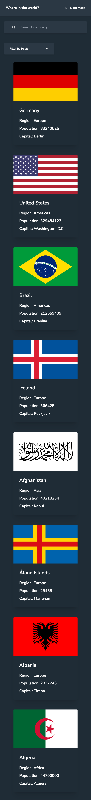
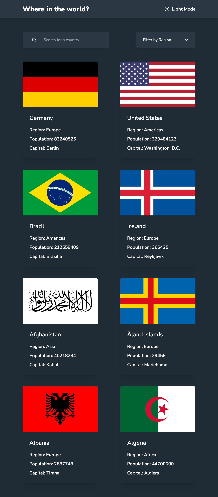
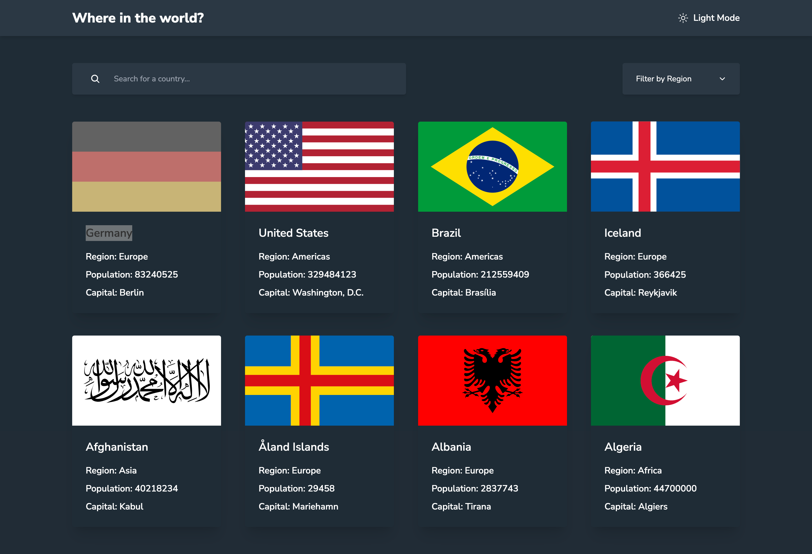

# Rest-Countries

This is a solution to the [REST Countries API challenge on Frontend Mentor](https://www.frontendmentor.io/challenges/rest-countries-api-with-color-theme-switcher-5cacc469fec04111f7b848ca)

## Table of contents

- [Overview](#overview)
  - [The challenge](#the-challenge)
  - [Screenshots](#screenshots)
    - [Mobile](#mobile)
    - [Details Mobile](#details-mobile)
    - [Tablet](#tablet)
    - [Details Tablet](#details-tablet)
    - [Desktop](#desktop)
    - [Details Desktop](#details-desktop)
  - [Links](#links)
  - [Built with](#built-with)
- [Author](#author)

## Overview

Users should be able to:

- See all countries from the API on the homepage
- Search for a country using an `input` field
- Filter countries by region
- Click on a country to see more detailed information on a separate page
- Click through to the border countries on the detail page
- Toggle the color scheme between light and dark mode

### Screenshots

#### Mobile

#### Details Mobile

#### Tablet

#### Details Tablet

#### Desktop

#### Details Desktop

### Links

- Solution URL: [Github](https://github.com/gfunk77/react-fem/tree/main/rest-countries)
- Live Site URL: [Netlify](https://gfunk77-rest-countries.netlify.app/)

### Built with

- [React](https://reactjs.org/)
- [React Router](https://reactrouter.com/)
- [React Query](https://tanstack.com/)
- [Tailwind](https://tailwindcss.com/)
- [Daisyui](https://daisyui.com/)

## Author

- Github - [gfunk77](https://github.com/gfunk77)
- Frontend Mentor - [@gfunk77](https://www.frontendmentor.io/profile/gfunk77)

# React + Vite

This template provides a minimal setup to get React working in Vite with HMR and some ESLint rules.

Currently, two official plugins are available:

- [@vitejs/plugin-react](https://github.com/vitejs/vite-plugin-react/blob/main/packages/plugin-react/README.md) uses [Babel](https://babeljs.io/) for Fast Refresh
- [@vitejs/plugin-react-swc](https://github.com/vitejs/vite-plugin-react-swc) uses [SWC](https://swc.rs/) for Fast Refresh
